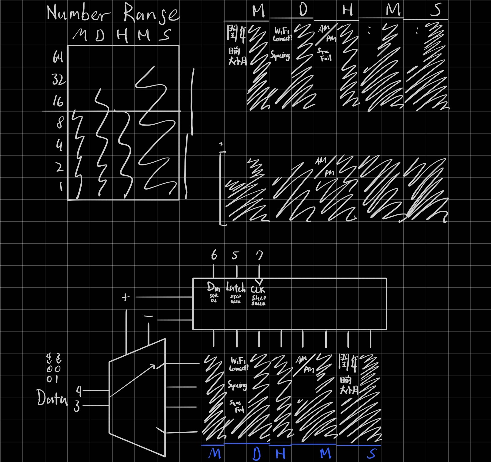

# A simple LED binary code on your desk

Useful: Probably 0  
Unique and fun: 100

Why do I waste my time making this?  
✨ Absolutely no reason ✨

Anyway

Function:

- Automatically get time from Wi-Fi.

- Display M/D H:M:S in binary

- Looks nice... probably

**THIS CODE HAVE NOT TESTED.** Use it on your own risk (Althought there's probably no risk on this. I mean, how far can it go wrong?)

## Design graph

## BOM

| Part               | Quantity |
| ------------------ | -------- |
| ESP32-C3 SuperMini | 1        |
| LED                | 32 (8*4) |
| 74HC595            | 1        |
| Decoder            | 1        |
| 1~1.1kΩ Resistor   | 8        |